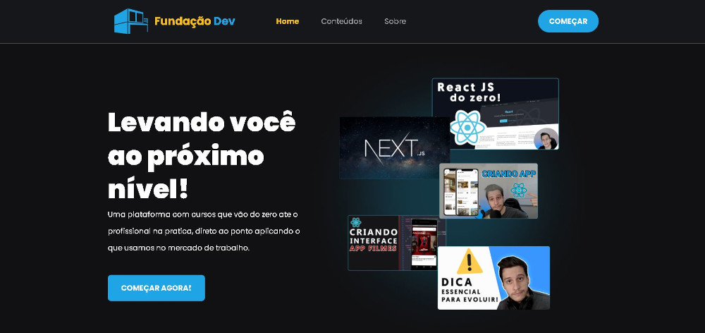

# Fundação Dev

<!---Esses são exemplos. Veja https://shields.io para outras pessoas ou para personalizar este conjunto de escudos. Você pode querer incluir dependências, status do projeto e informações de licença aqui--->
  

  
  

 
 > Levando você ao próximo nível!!
    
    
<h4 align="center"><a href="https://fundacao-dev.vercel.app/" target="_blank">Clique para visitar o projeto</a></h4>

 

## 📚 Seções

O site é composto por quatro seções:

- **Home:** Aqui temos a apresentaçao do instituição;
- **Conteúdo:** Nesta seção se encontra todos os posts;
- **Detalhes:** Apresenta os detalhes do post escolhido;
- **sobre:** Detalhes sobre a instituição;

---
 

## 🚀  Tecnologias:

- Next.js;
- Prismic ( Headless CMS );
- TypeScript;
- Styled-Components;

---

### Ajustes e melhorias

O projeto foi concluído e todas as tarefas finalizadas:

- [x] Tarefa 1
- [x] Tarefa 2
- [x] Tarefa 3
- [x] Tarefa 4
- [x] Tarefa 5

* Compatível `< Windows, Linux >`."

 
